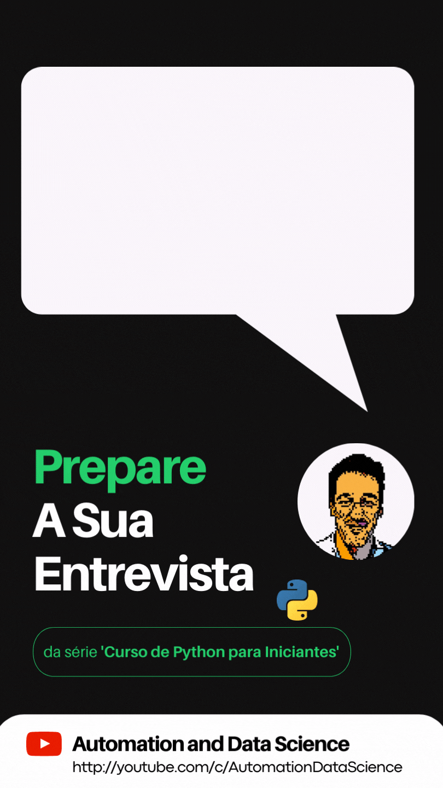

<!-- PROJECT LOGO -->
<br />
<div align="center">
 
  <h3 align="center">Prepare a sua Entrevista de Python</h3>

  <p align="center">
    Várias questões para aprender mais sobre Python e estar preparado/a para a sua entrevista.
    <br /></p>
</div>


<!-- ABOUT THE PROJECT -->
<div align="center"></div>

### Testes

```python
rsp = perimeter([(-1, 0), (2, 4), (10, 5)])
print(rsp)  # 25.15

rsp = perimeter([(0, 1), (1, 0), (0, 1)])
print(rsp)  # 2.83
```
<br><br>
### Apoie este projeto gratuito de educação
O canal de YouTube [Automation and Data Science](http://youtube.com/c/AutomationDataScience) é um projeto educativo
gratuito e em português. A missão do canal é ajudar todos a entrarem no mundo da programação.


Considere [subscrever](http://youtube.com/c/AutomationDataScience?sub_confirmation=1) o canal e promover junto dos seus
familiares, amigos e colegas. 

```python
msg_final = "A melhor forma de ajudar este projeto é partilhar e subscrever."

while True:
    print(msg_final)
```
[![YouTube][youtube-shield]][youtube-url]


[youtube-shield]: https://img.shields.io/badge/youtube-red.svg?style=for-the-badge&logo=youtube&colorB=c4302b
[youtube-url]: https://youtube.com/c/AutomationDataScience
